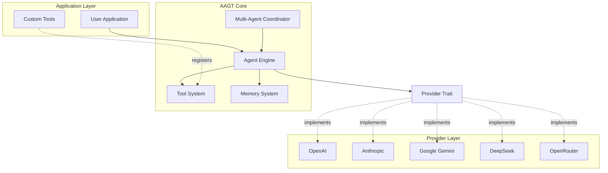
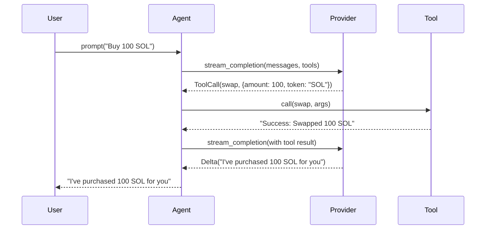
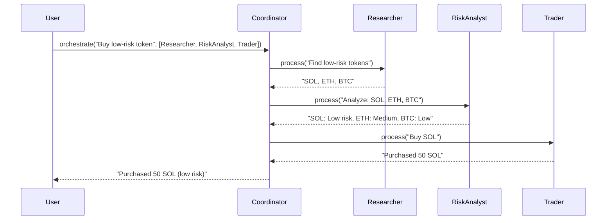

# AAGT Architecture Documentation

**Advanced Autonomous Agent Toolkit - Technical Design**

---

## Table of Contents

1. [Overview](#overview)
2. [System Architecture](#system-architecture)
3. [Core Components](#core-components)
4. [Workflow](#workflow)
5. [API Reference](#api-reference)
6. [Design Decisions](#design-decisions)

---

## Overview

AAGT is a lightweight, high-performance framework for building AI agents in Rust. It provides a modular architecture that separates concerns between LLM providers, agent logic, and tool execution.

### Key Design Principles

- **Modularity**: Clear separation between core abstractions and implementations
- **Performance**: Async-first design with zero-cost abstractions
- **Safety**: Leveraging Rust's type system to prevent common errors
- **Extensibility**: Easy to add new providers, tools, and agent behaviors

---

## System Architecture

### High-Level Architecture



### Module Breakdown

#### 1. **aagt-core**
Core abstractions and business logic.

**Key Files:**
- `agent.rs` - Agent engine and builder
- `tool.rs` - Tool trait and registry
- `provider.rs` - LLM provider interface
- `memory.rs` - Short-term and long-term memory
- `multi_agent.rs` - Multi-agent coordination
- `message.rs` - Message types and content handling

#### 2. **aagt-providers**
LLM provider implementations.

**Supported Providers:**
- OpenAI (GPT-4, GPT-3.5)
- Anthropic (Claude 3.5 Sonnet, Haiku, Opus)
- Google Gemini (2.0 Flash, 1.5 Pro)
- DeepSeek
- OpenRouter (aggregator)

#### 3. **aagt-macros**
Procedural macros for developer convenience.

**Macros:**
- `simple_tool!` - Define tools with minimal boilerplate

---

## Core Components

### 1. Agent Engine

The `Agent` struct is the central orchestrator.

**Responsibilities:**
- Manage conversation history
- Route requests to LLM providers
- Execute tool calls
- Handle streaming responses

**Key Methods:**
```rust
impl<P: Provider> Agent<P> {
    pub fn builder(provider: P) -> AgentBuilder<P>;
    pub async fn prompt(&self, input: &str) -> Result<String>;
    pub async fn stream(&self, input: &str) -> Result<impl Stream<Item = String>>;
}
```

### 2. Tool System

Tools are the primary way agents interact with the external world.

**Tool Trait:**
```rust
#[async_trait]
pub trait Tool: Send + Sync {
    fn name(&self) -> String;
    async fn definition(&self) -> ToolDefinition;
    async fn call(&self, arguments: &str) -> Result<String>;
}
```

**Tool Registry:**
- Thread-safe storage using `DashMap`
- Dynamic tool registration/removal
- Automatic JSON schema generation

### 3. Provider Interface

Unified interface for all LLM providers.

**Provider Trait:**
```rust
#[async_trait]
pub trait Provider: Send + Sync {
    async fn stream_completion(
        &self,
        model: &str,
        system_prompt: Option<&str>,
        messages: Vec<Message>,
        tools: Vec<ToolDefinition>,
        config: CompletionConfig,
    ) -> Result<StreamingResponse>;
}
```

**Streaming Response:**
```rust
pub enum StreamingChoice {
    Delta(String),
    ToolCall { id: String, name: String, arguments: String },
    ParallelToolCalls(HashMap<usize, ToolCall>),
    Done,
}
```

### 4. Memory System

Two-tier memory architecture:

**Short-Term Memory:**
- Ring buffer for recent conversation
- Configurable capacity (default: 20 messages)
- Per-user isolation

**Long-Term Memory:**
- Vector-store integration ready
- Token-aware retrieval
- Automatic cleanup of stale data

**API:**
```rust
impl ShortTermMemory {
    pub fn add(&self, user_id: &str, message: Message);
    pub fn get_recent(&self, user_id: &str, limit: usize) -> Vec<Message>;
}

impl LongTermMemory {
    pub fn store_entry(&self, user_id: &str, entry: MemoryEntry);
    pub fn retrieve_recent(&self, user_id: &str, limit: usize, char_limit: usize) -> Vec<MemoryEntry>;
}
```

### 5. Multi-Agent Coordination

Swarm-based architecture for complex workflows.

**Coordinator:**
```rust
impl Coordinator {
    pub fn register(&mut self, role: AgentRole, agent: Arc<dyn MultiAgent>);
    pub async fn orchestrate(&self, task: &str, workflow: Vec<AgentRole>) -> Result<String>;
}
```

**Workflow Example:**
```
User Request → Researcher → Risk Analyst → Trader → Response
```

---

## Workflow

### Standard Request Flow



### Multi-Agent Workflow



---

## API Reference

### Agent Builder

```rust
let agent = Agent::builder(provider)
    .model("gpt-4")
    .preamble("You are a trading assistant")
    .temperature(0.7)
    .max_tokens(2000)
    .tool(Box::new(SwapTool))
    .build()?;
```

### Tool Definition

```rust
use aagt_core::simple_tool;

simple_tool!(
    FetchPrice,
    "fetch_price",
    "Get current price of a token",
    {
        symbol: ("string", "Token symbol (e.g., SOL, ETH)")
    },
    [symbol],
    |args| async move {
        let symbol = args["symbol"].as_str().unwrap();
        let price = fetch_from_api(symbol).await?;
        Ok(format!("${}", price))
    }
);
```

### Memory Usage

```rust
use aagt_core::memory::{ShortTermMemory, LongTermMemory};

let short_term = ShortTermMemory::new(20);
short_term.add("user_123", Message::user("Hello"));

let long_term = LongTermMemory::new(1000);
long_term.store_entry("user_123", MemoryEntry {
    content: "User prefers low-risk trades".to_string(),
    timestamp: Utc::now(),
});
```

---

## Design Decisions

### Why Rust?

1. **Performance**: Zero-cost abstractions and no garbage collection
2. **Safety**: Compile-time guarantees prevent data races and null pointer errors
3. **Concurrency**: First-class async/await support via Tokio
4. **Ecosystem**: Rich crate ecosystem for HTTP, JSON, and crypto operations

### Why Trait-Based Design?

- **Flexibility**: Easy to swap LLM providers without changing agent code
- **Testability**: Mock providers for unit testing
- **Extensibility**: Users can implement custom providers

### Why DashMap for Tool Registry?

- **Thread-Safe**: Lock-free concurrent access
- **Performance**: Faster than `RwLock<HashMap>` for read-heavy workloads
- **Simplicity**: No manual lock management

### Memory Management Strategy

**Short-Term Memory:**
- Ring buffer prevents unbounded growth
- Per-user isolation via `DashMap<String, VecDeque>`

**Long-Term Memory:**
- Sorted by timestamp for efficient retrieval
- Character limit prevents context window overflow
- Future: Integration with vector databases (Qdrant, Pinecone)

---

## Future Roadmap

- [ ] Vector database integration for semantic memory search
- [ ] Built-in observability (OpenTelemetry traces)
- [ ] Agent composition patterns (pipelines, DAGs)
- [ ] Fine-tuning support for custom models
- [ ] Web UI for agent monitoring

---

## Performance Benchmarks

*(Coming soon)*

---

## Contributing

See [CONTRIBUTING.md](./CONTRIBUTING.md) for development guidelines.
