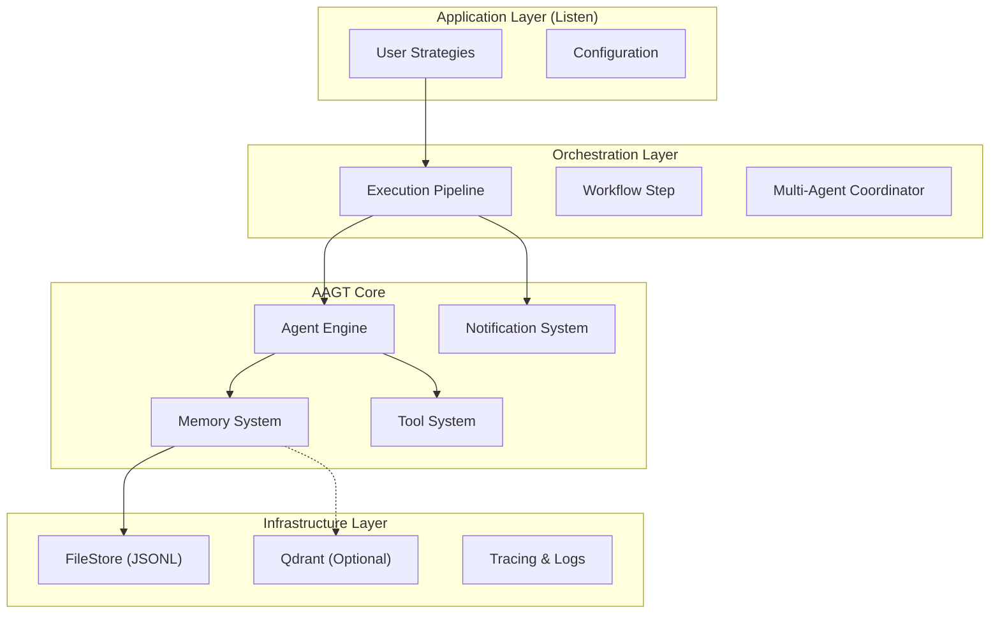

# AAGT Architecture Documentation

**AI Agent Trade - Technical Design**

---

## Table of Contents

1. [Overview](#overview)
2. [System Architecture](#system-architecture)
3. [Core Components](#core-components)
4. [Workflow](#workflow)
5. [API Reference](#api-reference)
6. [Future Roadmap](#future-roadmap)

---

## Overview

AAGT is a lightweight, high-performance framework for building AI agents in Rust. It focuses on modularity and dual-scalability: capable of running on minimal hardware ($5 VPS) while scaling to institutional-grade systems.

### Key Design Principles

- **Modularity**: Clear separation between core abstractions and implementations.
- **Affordability**: Designed to run efficiently on single-core, low-RAM VPS environments.
- **Safety**: Panic-free core with robust error propagation.
- **Observability**: Built-in `tracing` for full system visibility without external dependencies.

---

## System Architecture

### High-Level Architecture



### Module Breakdown

#### 1. **aagt-core**
Core abstractions and business logic.
- `agent.rs`: The central engine managing LLM interaction.
- `pipeline.rs`: Implementation of sequential execution flows (DAGs).
- `store/`: Memory storage implementations (`FileStore` for low-resource, traits for Vector DBs).
- `notifications.rs`: Integrated alert system (Telegram, Discord, Email).
- `rag.rs`: Retrieval-Augmented Generation interfaces.

#### 2. **aagt-providers**
LLM provider integrations (Gemini, DeepSeek, OpenAI, etc.).

---

## Core Components

### 1. Execution Pipeline
AAGT replaces ad-hoc scripts with structured pipelines. Pipelines allow mixing AI steps with rigid Rust logic (e.g., Risk Checks).

**Concept:**
```rust
Pipeline::new("Trading Flow")
    .add_step(FetchData)
    .add_step(HardCodedRiskCheck) // Fails fast if risk > limit
    .add_step(AgentAnalysis)      // Only calls LLM if check passes (saves tokens)
    .add_step(ExecuteTrade)
    .add_step(TelegramNotify)
```

### 2. Hybrid Memory Store
The framework supports a pluggable memory backend to suit the deployment environment.

- **FileStore (JSONL)**:
  - **Target**: Cheap VPS (1GB RAM).
  - **Impl**: Append-only JSONL files + In-memory vector calculation.
  - **Benefit**: Zero external dependencies (no DB required).
  
- **VectorStore (Trait)**:
  - **Target**: Institutional / High-scale.
  - **Impl**: Interface for Qdrant / pgvector.

### 3. Notification System
Integrated directly into the pipeline as a `Step`.
- **Channels**: Telegram, Discord, Email.
- **Design**: Fully async, non-blocking, fail-safe.

---

## Workflow

### The "Listener" Loop (Low-Resource Pattern)

1. **Wake Up**: `cron` triggers the Pipeline every hour.
2. **Fetch**: `FetchMarketData` step runs (HTTP call).
3. **Filter**: `SignalFilter` (Rust logic) checks if volatility > 5%.
   - *If No*: Pipeline aborts. **Cost: $0**.
   - *If Yes*: Proceed to next step.
4. **Analyze**: `Agent` is invoked with context. **Cost: LLM Token**.
5. **Act**: `Execute` step signs transaction.
6. **Notify**: `TelegramStep` sends report to user.
7. **Sleep**: Process releases resources.

---

## Future Roadmap

### ✅ Completed
- [x] **Vector Database Support**: Abstracted via `VectorStore` trait.
- [x] **Low-Resource Mode**: Implemented `FileStore` (JSONL) & `MarkdownMemory`.
- [x] **Observability**: Implemented `tracing` integration.
- [x] **Pipelines**: Sequential execution engine for complex workflows.
- [x] **Notifications**: Built-in Telegram/Discord support.

### 📅 Planned (Next)
- [ ] **Strategy Backtesting Engine**: Simulate pipelines against historical data.
- [ ] **Python Bindings (PyO3)**: Allow Python users to define strategies using Rust core.
- [ ] **WASM Support**: Re-visit WASM for edge trading (e.g., in-browser agents).

### ❌ Out of Scope
- **Web UI**: AAGT is a headless framework. Users should build UIs separately or use CLI/Chat interfaces.
- **Model Fine-Tuning**: AAGT consumes models, it does not train them.

---

## Design Decisions

### Why JSONL for Memory?
For 99% of individual users, 10,000 memory entries is plenty. A 10MB JSONL file can be entirely loaded into RAM on a $5 VPS, offering faster retrieval than a network call to a Vector DB, with zero operational overhead.

### Why "Pipeline" over "Chain"?
LangChain's "Chain" implies distinct AI calls. AAGT's "Pipeline" emphasizes **hybrid execution**: mixing AI (Probabilistic) with Rust Code (Deterministic). This is crucial for financial applications where Risk Checks must be deterministic code, not "hallucinatable" AI prompts.
