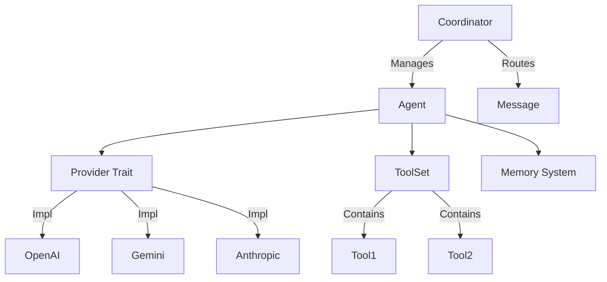

# AAGT (Autonomous Agent Toolkit)

**A lightweight, modular, and high-performance framework for building AI Agents in Rust.**

AAGT provides the core abstractions and utilities needed to build complex, multi-agent systems with minimal overhead. It is designed to be flexible, safe, and easy to extend.

## 🚀 Features

*   **Modular Architecture**: Core logic (`aagt-core`) is separated from provider implementations (`aagt-providers`).
*   **Provider Agnostic**: Support for multiple LLM backends (OpenAI, Anthropic, Gemini, DeepSeek, OpenRouter) via a unified `Provider` trait.
*   **Robust Memory System**:
    *   **Short-term Memory**: Efficient ring-buffer conversation history.
    *   **Long-term Memory**: Persistent vector-store ready memory with token-aware retrieval.
*   **Multi-Agent Coordination (Swarm)**:
    *   **Dynamic Workflows**: Define agent chains dynamically at runtime.
    *   **Role-Based Routing**: Delegate tasks to specialized agents (Researcher, Trader, Risk Analyst).
*   **Safety First**: Rust-based type safety, thread-safe internals (`Arc`, `DashMap`), and built-in protections against context window overflows.
*   **Async Native**: Built on `tokio` for high-concurrency performance.

## 📦 Architecture



## 🛠️ Usage

### 1. Installation

Add `aagt` to your `Cargo.toml`:

```toml
[dependencies]
aagt-core = { path = "aagt-core" }
aagt-providers = { path = "aagt-providers" }
tokio = { version = "1.0", features = ["full"] }
```

### 2. Create a Simple Agent

```rust
use aagt_core::prelude::*;
use aagt_providers::gemini::{Gemini, GEMINI_2_0_FLASH};

#[tokio::main]
async fn main() -> anyhow::Result<()> {
    // 1. Initialize Provider
    let provider = Gemini::from_env()?;

    // 2. Build Agent
    let agent = Agent::builder(provider)
        .model(GEMINI_2_0_FLASH)
        .preamble("You are a helpful assistant.")
        .build()?;

    // 3. Chat
    let response = agent.prompt("Hello, who are you?").await?;
    println!("{}", response);
    
    Ok(())
}
```

### 3. Multi-Agent Swarm

```rust
use aagt_core::multi_agent::{Coordinator, AgentRole};

// Initialize Coordinator
let coordinator = Coordinator::new();

// Register Agents
coordinator.register(researcher_agent);
coordinator.register(writer_agent);

// Define Workflow: Research -> Write
let workflow = vec![AgentRole::Researcher, AgentRole::Assistant];

// Execute
let result = coordinator.orchestrate("Research Rust async trends", workflow).await?;
```

## 📂 Project Structure

*   `aagt-core`: Core interfaces (Agent, Provider, Tool, Memory, MultiAgent).
*   `aagt-providers`: Implementations for various LLMs.
*   `aagt-macros`: Helper macros for defining tools easily.

## 📄 License

MIT
