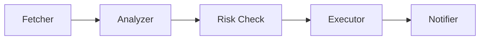

# AAGT: High-Performance AI Agent Framework for Trading

[](https://crates.io/crates/aagt-core)
[](LICENSE)
[](https://github.com/undead-undead/aagt/actions)

**AAGT (AI Agent Trade)** is a modular, high-performance Rust framework designed for building autonomous trading agents. 

🚀 **From $5 VPS to Institutional Servers**  
AAGT is built to scale. It runs efficiently on a 1GB RAM budget (using file-based memory) but can scale up to handle complex swarms with vector databases like Qdrant.

---

## ✨ Key Features

### 1. ⚡ Ultra-Lightweight & Efficient
- **Rust Native**: Zero garbage collection pauses, minimal memory footprint.
- **Resource Optimized**: Runs primarily on `tokio` async runtime.
- **"Poor Man's" Mode**: Includes `FileStore` (JSONL) and `MarkdownMemory` for running agents on cheap VPS instances without heavy databases.

### 2. 🧠 Hybrid Memory System
- **Vector Store Interface**: Plug in **Qdrant** for production or use **JSONL files** for local/low-resource setups.
- **Explicit Memory**: Agents can write Markdown notes (e.g., `trading_log.md`) to reflect on past decisions.

### 3. ⛓️ Execution Pipelines
Build complex trading strategies using a structured pipeline approach:

- **Lazy Execution**: Steps only run when needed (saving tokens and API costs).
- **Hybrid Logic**: Mix LLM intelligence with hard-coded Rust logic (e.g., rigid risk controls).

### 4. 📣 Built-in Notifications
Zero-cost integration with your favorite platforms:
- **Telegram** (Bot API)
- **Discord** (Webhooks)
- **Email** (via HTTP APIs)

### 5. 🛡️ Trading-First Security
- **Panic-Free Core**: Rigorously tested to prevent runtime crashes.
- **Risk Manager**: Built-in modules to enforce drawdown limits and position sizing.

---

## 🚀 Quick Start

### Installation

Add to your `Cargo.toml`:

```toml
[dependencies]
aagt-core = { git = "https://github.com/undead-undead/aagt" }
aagt-providers = { git = "https://github.com/undead-undead/aagt" }
tokio = { version = "1", features = ["full"] }
```

### Example: A Low-Resource Trading Agent

This agent analyzes the market, checks risk, and notifies you contextually.

```rust
use aagt_core::prelude::*;
use aagt_core::pipeline::{Pipeline, Context};
use aagt_core::notifications::TelegramStep;
use aagt_core::store::FileStoreConfig;

#[tokio::main]
async fn main() -> Result<()> {
    // 1. Setup lightweight memory (JSONL file)
    let memory = FileStore::new(FileStoreConfig::new("data/memory.jsonl")).await?;

    // 2. Build the Agent
    let provider = Gemini::from_env()?;
    let agent = Agent::builder(provider)
        .model("gemini-2.0-flash")
        .memory(memory)
        .build()?;

    // 3. Define the Strategy Pipeline
    let pipeline = Pipeline::new("Daily Analysis")
        .add_step(FetchMarketData)      // Custom Step
        .add_step(AgentAnalyzeStep)     // Agent Step
        .add_step(TelegramStep::new(
            "YOUR_BOT_TOKEN",
            "YOUR_CHAT_ID", 
            "📈 Analysis: {outcome}"
        ));

    // 4. Run it!
    pipeline.run("Analyze BTC").await?;
    
    Ok(())
}
```

---

## 📂 Project Structure

- **`aagt-core`**: The brain. Traits, Pipelines, Memory, and basic Tools.
- **`aagt-providers`**: LLM integrations (Gemini, OpenAI, DeepSeek, etc.).
- **`aagt-macros`**: Proc-macros for simplifying Tool creation.

---

## 💡 Philosophy

We believe AI trading should be **democratized**. 
Most frameworks assume you have unlimited budgets for GPUs and SaaS subscriptions. AAGT assumes you might be a student or independent researcher running on a tight budget, but who still demands **professional-grade reliability**.

---

## use Cases

### 1. The "Listener" Node
Deploy a lightweight agent on a $5/mo VPS. It sleeps most of the time, wakes up every hour to check on-chain data, and only burns tokens if it spots an anomaly.

### 2. The Social Swarm
Coordinate multiple agents (Analyst, Trader, Risk Officer) to manage a Moltbook account, posting high-quality automated analysis based on real market moves.

---

## 🤝 Contributing

We welcome contributions! Please check out [ARCHITECTURE.md](./ARCHITECTURE.md) to understand the system design before submitting PRs.

## 📄 License

MIT
