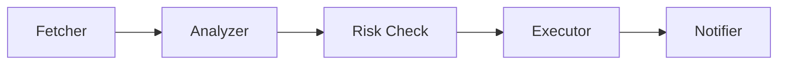

# AAGT - AI Agent Framework for Trading

[](https://crates.io/crates/aagt-core)
[](LICENSE)
[](https://github.com/undead-undead/aagt/actions)

**AAGT (AI Agent Trade)** is a robust, modular, and secure framework for building autonomous trading agents. 

**From $5 VPS to Institutional Servers**  
AAGT is built to scale. It runs efficiently on a 1GB RAM budget (using file-based memory) but can scale up to handle complex swarms with vector databases like Qdrant. AAGT leverages Rust's safety and performance to manage multiple agents with strict risk controls.

---

## � Key Features

### 1. Ultra-Lightweight & Efficient
- **Rust Native**: Zero garbage collection pauses, minimal memory footprint.
- **Resource Optimized**: Runs primarily on `tokio` async runtime.
- **"Poor Man's" Mode**: Includes `FileStore` (JSONL) and `MarkdownMemory` for running agents on cheap VPS instances without heavy databases.

### 2. Hybrid Memory System
- **Vector Store Interface**: Plug in **Qdrant** for production or use **JSONL files** for local/low-resource setups.
- **Explicit Memory**: Agents can write Markdown notes (e.g., `trading_log.md`) to reflect on past decisions.

### 3. Execution Pipelines
Build complex trading strategies using a structured pipeline approach:

- **Lazy Execution**: Steps only run when needed (saving tokens and API costs).
- **Hybrid Logic**: Mix LLM intelligence with hard-coded Rust logic (e.g., rigid risk controls).

### 4. Built-in Notifications
Zero-cost integration with your favorite platforms:
- **Telegram** (Bot API)
- **Discord** (Webhooks)
- **Email** (via HTTP APIs)

---

## �🏗 Architecture

The project is structured as a Cargo workspace:

- **`aagt-core`**: The heart of the framework.
    - **Agent System**: `Agent` and `MultiAgent` abstractions for single or coordinated agent workflows.
    - **Risk Management**: `RiskManager` using the Actor model to ensure thread-safe, durable state management.
    - **Pipeline Engine**: `StrategyEngine` for executing conditional trading logic (Conditions -> Actions).
    - **Memory**: Short-term (RAM) and Long-term (Vector Store/JSON) memory systems.
- **`aagt-providers`**: Integrations for LLMs (OpenAI, Gemini, DeepSeek, etc.).
- **`aagt-macros`**: Procedural macros to simplify tool creation.

### Technical Highlights
- **Actors**: Components like `RiskManager` use an actor pattern (channels) to manage state without locks, ensuring high concurrency.
- **Dynamic Strategies**: Strategies are defined as data (JSON), allowing dynamic reloading without recompilation.
- **Explicit Tools**: Capabilities are explicit and self-describing via `Tool` traits.

---

## 🛡 Security Review

Security is a first-class citizen for automated trading in AAGT:

1.  **Risk Management Loop**:
    - Every trade action must pass through the `RiskManager`.
    - **Stateless Checks**: Max single trade size, max slippage, min liquidity, rug pull detection.
    - **Stateful Checks**: Max daily volume limits. State is persisted durably to disk (JSON).
    - **Actor Isolation**: Risk state is managed by a dedicated actor preventing race conditions.

2.  **Environment Security**:
    - API Keys (e.g., `OPENAI_API_KEY`) are loaded strictly from environment variables. **DO NOT** hardcode secrets.

3.  **Operations**:
    - **File-based persistence** (FileStore) ensures data ownership remains on your server.

---

## 🚀 Deployment (VPS Guide)

Recommended setup for a single-user VPS deployment running multiple agents.

### Prerequisites
- **Rust**: Install via `rustup`.
- **Systemd**: For process management.

### Installation & Setup

1.  **Clone the repository**:
    ```bash
    git clone https://github.com/undead-undead/aagt.git
    cd aagt
    ```

2.  **Configuration**:
    Create a `.env` file in the root:
    ```bash
    OPENAI_API_KEY=sk-proj-....
    RUST_LOG=info
    ```

3.  **Build a Runner**:
    ```bash
    cargo build --release --example basic_agent
    ```

### Running as a Service (Systemd)

Create `/etc/systemd/system/aagt.service`:

```ini
[Unit]
Description=AAGT Trading Agents
After=network.target

[Service]
User=your_user
WorkingDirectory=/home/your_user/aagt
ExecStart=/home/your_user/aagt/target/release/examples/basic_agent
Restart=always
EnvironmentFile=/home/your_user/aagt/.env

[Install]
WantedBy=multi-user.target
```

Enable and start:
```bash
sudo systemctl enable aagt
sudo systemctl start aagt
```

---

## 🧠 Usage Example

### Creating an Agent

```rust
use aagt_core::prelude::*;
use aagt_providers::openai::OpenAI;

#[tokio::main]
async fn main() -> Result<()> {
    let provider = OpenAI::from_env()?;
    
    let agent = Agent::builder(provider)
        .model("gpt-4o")
        .preamble("You are a specialized crypto trading assistant.")
        .build()?;

    let response = agent.prompt("Analyze the current trend of SOL").await?;
    println!("{}", response);
    Ok(())
}
```

### Risk Configuration

```rust
let config = RiskConfig {
    max_single_trade_usd: 1000.0,
    max_daily_volume_usd: 5000.0,
    stop_loss_percent: 5.0,
    ..Default::default()
};
let risk_manager = RiskManager::with_config(config, store);
```

---

## ⚠️ Disclaimer

This software is for educational and research purposes. Cryptocurrency trading involves significant risk. The authors are not responsible for financial losses. Always test strategies in simulation mode first.
