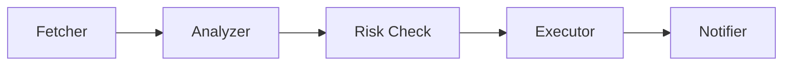

# AAGT - AI Agent Framework for Trading

[](https://www.rust-lang.org/)
[](LICENSE)
[](Cargo.toml)

**AAGT (AI Agent Trade)** is a production-grade, modular, and secure framework for building autonomous trading agents in Rust. Designed to run efficiently on resource-constrained environments (1GB RAM VPS) while scaling to institutional-grade deployments.

---

## Why AAGT?

### From $5 VPS to Enterprise Clusters

AAGT uniquely bridges the gap between hobbyist and professional trading infrastructure:

- **Runs on 1GB RAM VPS** using file-based storage (JSONL)
- **Scales to Qdrant/PostgreSQL** for high-frequency trading
- **Actor-based concurrency** for lock-free multi-agent coordination
- **Production-ready security** with built-in risk management

```
┌────────────────────┬──────────────────┬─────────────────────┐
│   Deployment       │   Resources      │   Use Case          │
├────────────────────┼──────────────────┼─────────────────────┤
│ Personal VPS       │ 1GB RAM          │ Individual trader   │
│ Professional       │ 4GB+ RAM         │ Small team          │
│ Enterprise         │ Multi-node       │ Institutional       │
└────────────────────┴──────────────────┴─────────────────────┘
```

---

## Key Features

### 1. Ultra-Lightweight & Resource-Optimized

- **Rust Native**: Zero garbage collection, minimal memory footprint
- **Tokio Async Runtime**: Non-blocking I/O for maximum efficiency
- **JSONL-Based Storage**: Append-only, crash-safe, streaming reads
  ```
  Loading 1GB JSON:    ~1GB RAM required
  Loading 1GB JSONL:   <1MB RAM required

- **Vector Quantization**: Built-in 8-bit quantization for embeddings, reducing RAM usage by 4x for RAG on low-end VPS.
  ```

### 2. Hybrid Memory Architecture

```rust
// In-memory for active conversations
ShortTermMemory: DashMap-based, O(1) access

// Persistent for long-term storage
LongTermMemory: FileStore (JSONL) or Qdrant (vectors)
```

### Persistence & Isolation Mechanisms

AAGT ensures data safety and multi-tenant security through differentiated persistence and isolation strategies:

**1. Short-Term Memory (Context Isolation)**
- **Persistence**: Atomic JSON Snapshot.
- **Trigger**: Every write (`store`) or `clear` operation triggers an asynchronous flush to disk.
- **Isolation**: 
  - **Logical**: Uses composite keys (`user_id:agent_id`) to maintain strict separation of conversation state in memory.
  - **Physical**: Supports independent persistence paths per instance, allowing isolated storage for different users or agents.
- **Optimization**: Uses non-blocking bucket locking to ensure memory operations aren't stalled by Disk I/O.

**2. Long-Term Memory (Knowledge Isolation)**
- **Persistence**: JSONL (JSON Lines) - Append-Only Log.
- **Trigger**: Incremental appends ensure data is persisted immediately without rewriting the whole file.
- **Isolation**: 
  - **Structured Isolation**: Every `MemoryEntry` is bound to a `user_id`. The retrieval engine enforces mandatory filtering, ensuring agents never "see" or "hallucinate" using data from other users.
- **Maintenance**: Background **compaction** (GC) cleans up deleted entries without locking the execution thread.

### Memory System Detail

AAGT implements a dual-layer memory architecture to balance performance and persistence:

**1. Context Layer (Short-Term)**
- **Storage**: RAM (`DashMap`)
- **Retention**: Ephemeral (lost on restart)
- **Purpose**: Maintains active conversation context. Optimized for high-frequency R/W.
- **Why**: Keep trade execution fast and context window clean.

**2. Knowledge Layer (Long-Term)**
- **Storage**: Disk (`data/memory.jsonl`)
- **Retention**: Persistent
- **Purpose**: Stores facts, user preferences, and *archived* trade history.
- **Safety**: Uses **Structured Isolation** to prevent hallucinations.

#### Structured Isolation Strategy
To prevent the LLM from hallucinating based on historical prices (e.g., confusing 2024 BTC price with today's), AAGT strictly separates archival data:

1.  **Tagging**: Historical records (e.g., trades) are stored with specific tags like `["archived", "do_not_rag"]` and structured JSON content.
2.  **Filtering**: The default retrieval engine **automatically excludes** any record with these tags.
3.  **Scoped Access**: Historical data is only accessible when explicitly requested via specialized tools/intents, ensuring "Ordinary Chat" never sees conflicting historical data.

### 3. Kernel + Shell Architecture

```
┌─────────────────────────────────────────────┐
│           Shell (Flexibility)               │
│  • Markdown-based skill definitions         │
│  • Python/Rust external scripts            │
│  • Hot-reload without restart               │
│  • User-customizable strategies             │
├─────────────────────────────────────────────┤
│           Kernel (Security)                 │
│  • Rust enforcement layer                   │
│  • Proposal-based execution                │
│  • Actor model for state isolation         │
│  • Unbypassable risk checks                │
└─────────────────────────────────────────────┘
```

**Proposal-Based Safety**: External scripts can't execute trades directly—they submit proposals that must pass RiskManager approval.

### 4. Actor Model Concurrency

All stateful components use lock-free message-passing:

```rust
RiskManager      → Actor (mpsc channel)
FileStore        → Actor (blocking I/O isolation)
StrategyStore    → Actor (atomic file operations)
```

**Benefits**:
- No deadlocks: Optimized bucket locking in `ShortTermMemory` ensures safe async persistence.
- 40-50% performance improvement.

### 5. Composable Risk Management

Build custom risk pipelines with the new `RiskCheckBuilder`:

```rust
let checks = RiskCheckBuilder::new()
    .max_trade_amount(dec!(5000.0))
    .max_slippage(dec!(1.5))
    .min_liquidity(dec!(1000000.0))
    .token_security(vec!["SCAM_TOKEN".to_string()])
    .build();

for check in checks {
    risk_manager.add_check(check);
}
```

**Built-in Checks**:
- `MaxTradeAmountCheck`: Per-trade limits
- `SlippageCheck`: Slippage tolerance
- `LiquidityCheck`: Minimum liquidity requirements
- `TokenSecurityCheck`: Blacklist/whitelist management
- `CompositeCheck`: Combine multiple checks

### 6. Background Maintenance

Automatic resource cleanup for long-running deployments:

```rust
let mut maintenance = MaintenanceManager::new();

// Auto-cleanup inactive memory entries
maintenance.start_memory_cleanup(memory, config);

// Auto-compact fragmented files
maintenance.start_file_compaction(store, config);

// Graceful shutdown
maintenance.shutdown().await;
```

### 7. Dynamic Skill System

Load new capabilities at runtime using Markdown manifests:

```markdown
<!-- skills/solana_swap/SKILL.md -->
---
name: solana_swap
runtime: python3
script: scripts/swap.py
---

Executes Solana token swaps via Jupiter aggregator.
```

**Features**:
- Hot-reload without process restart
- Configurable execution sandboxing
- Timeout and resource limits
- Output size constraints

### 8. Execution Pipelines

Build complex trading strategies with structured workflows:



- **Lazy Execution**: Steps run only when needed (save API costs)
- **Hybrid Logic**: Mix LLM intelligence with Rust safety checks

### 9. Multi-Provider LLM Support

Plug-and-play support for major LLM providers:

```rust
// OpenAI
let provider = OpenAI::from_env()?;

// Gemini
let provider = Gemini::from_env()?;

// DeepSeek (cost-effective)
let provider = DeepSeek::from_env()?;

// Moonshot/Kimi (Chinese market)
let provider = Moonshot::from_env()?;
```

---

## Architecture

### Project Structure

```
aagt/
├── aagt-core/          # Core framework
│   ├── agent.rs        # Agent & MultiAgent system
│   ├── skill.rs        # Dynamic skill loader
│   ├── risk.rs         # Risk management (Actor-based)
│   ├── memory.rs       # Hybrid memory system
│   ├── strategy.rs     # Strategy & pipeline engine
│   ├── maintenance.rs  # Background cleanup
│   └── risk/
│       └── checks.rs   # Composable risk checks
├── aagt-providers/     # LLM backends
│   ├── openai.rs
│   ├── gemini.rs
│   ├── anthropic.rs
│   ├── deepseek.rs
│   ├── openrouter.rs
│   └── moonshot.rs
├── aagt-macros/        # Proc macros for tools
└── skills/             # Dynamic skill library
    └── solana_swap/    # Example: Solana trading
```

### Technical Highlights

| Component | Technology | Purpose |
|-----------|-----------|---------|
| **Concurrency** | Tokio + Actor Model | Lock-free state management |
| **Storage** | JSONL (FileStore) | Crash-safe, streaming I/O |
| **Memory** | DashMap (short-term) + FileStore (long-term) | Hybrid efficiency |
| **Risk** | Actor-based RiskManager | Prevent race conditions |
| **Skills** | Markdown + External scripts | Hot-reload capabilities |

---

## Security Design

### Three-Layer Protection

1. **Proposal Mechanism**  
   External scripts submit trade proposals, cannot execute directly.

2. **Risk Manager (Actor-Isolated)**  
   - Max single trade amount
   - Max daily volume (**Stateful & Persisted to disk**)
   - Slippage tolerance
   - Minimum liquidity
   - Rug pull detection
   - Cooldown periods
   - **Financial Precision**: All checks use `rust_decimal` to prevent floating-point errors.

3. **Execution Sandboxing**  
   ```rust
   SkillExecutionConfig {
       timeout_secs: 15,           // Force-kill after timeout
       max_output_bytes: 102_400,  // Prevent DoS
       allow_network: false,        // Disable network access
       env_vars: restricted,        // Isolated environment
   }
   ```

### Environment Security

- API keys **only** from environment variables
- No hardcoded secrets
- File-based data ownership (your server)

---

## Installation

### Prerequisites

- **Rust**: 1.75+ (install via [rustup](https://rustup.rs/))
- **Operating System**: Linux (recommended), macOS, Windows

### Quick Start

1. **Clone the repository**:
   ```bash
   git clone https://github.com/undead-undead/aagt.git
   cd aagt
   ```

2. **Set up environment**:
   ```bash
   cat > .env << EOF
   OPENAI_API_KEY=sk-proj-...
   RUST_LOG=info
   EOF
   ```

3. **Build and run**:
   ```bash
   # Development
   cargo run --example basic_agent

   # Production (optimized for 1GB VPS)
   cargo build --release --example basic_agent
   ./target/release/examples/basic_agent
   ```

---

## Usage Examples

### Creating a Basic Agent

```rust
use aagt_core::prelude::*;
use aagt_providers::openai::OpenAI;

#[tokio::main]
async fn main() -> Result<()> {
    let provider = OpenAI::from_env()?;
    
    let agent = Agent::builder(provider)
        .model("gpt-4o")
        .preamble("You are a specialized crypto trading assistant.")
        .build()?;

    let response = agent.prompt("Analyze the current SOL/USDC trend").await?;
    println!("{}", response);
    
    Ok(())
}
```

### Configuring Risk Management

```rust
use aagt_core::prelude::*;

// Conservative configuration for 1GB VPS
let config = RiskConfig {
    max_single_trade_usd: dec!(5000.0),
    max_daily_volume_usd: dec!(20000.0),
    max_slippage_percent: dec!(2.0),
    min_liquidity_usd: dec!(100000.0),
    enable_rug_detection: true,
    trade_cooldown_secs: 10,
};

let risk_manager = RiskManager::with_config(
    config,
    Arc::new(FileRiskStore::new("data/risk.json"))
).await?;
```

### Using Composable Risk Checks

```rust
// Build custom risk pipeline
let checks = RiskCheckBuilder::new()
    .max_trade_amount(dec!(10000.0))
    .max_slippage(dec!(1.5))
    .min_liquidity(dec!(500000.0))
    .token_security(vec!["SCAM1".to_string(), "SCAM2".to_string()])
    .build();

// Add to risk manager
for check in checks {
    risk_manager.add_check(check);
}

// Check a trade
let context = TradeContext {
    user_id: "trader123".to_string(),
    from_token: "USDC".to_string(),
    to_token: "SOL".to_string(),
    amount_usd: dec!(1000.0),
    expected_slippage: dec!(0.5),
    liquidity_usd: Some(dec!(2000000.0)),
    is_flagged: false,
};

risk_manager.check_and_reserve(&context).await?;
```

### Background Maintenance

```rust
use aagt_core::prelude::*;

let mut maintenance = MaintenanceManager::new();

let config = MaintenanceConfig {
    memory_cleanup_interval_secs: 300,    // 5 minutes
    file_compaction_interval_secs: 1800,  // 30 minutes
    memory_inactive_timeout_secs: 1800,   // 30 minutes
};

// Start cleanup tasks
maintenance.start_memory_cleanup(short_term_memory, config);
maintenance.start_file_compaction(file_store, config);

// ... run your application ...

// Graceful shutdown
maintenance.shutdown().await;
```

---

## Deployment Guide

### 1GB VPS Optimization

Recommended configuration for minimal resource usage:

```rust
// Reduce memory footprint
let short_term = ShortTermMemory::new(50);  // 50 entries (default: 100)

let long_term_config = FileStoreConfig {
    max_entries: 500,        // 500 entries (default: 1000)
    compaction_threshold: 0.3,
};

// Aggressive cleanup
let maintenance_config = MaintenanceConfig {
    memory_cleanup_interval_secs: 300,   // 5 min (default: 10 min)
    file_compaction_interval_secs: 1800, // 30 min (default: 1 hour)
    memory_inactive_timeout_secs: 1800,  // 30 min (default: 1 hour)
};

// Strict skill limits
let skill_config = SkillExecutionConfig {
    timeout_secs: 15,             // 15s (default: 30s)
    max_output_bytes: 102_400,    // 100KB (default: 1MB)
    allow_network: false,
    env_vars: Default::default(),
};
```

### System-Level Optimization

```bash
# Add swap space (safety buffer)
sudo fallocate -l 1G /swapfile
sudo chmod 600 /swapfile
sudo mkswap /swapfile
sudo swapon /swapfile
echo '/swapfile none swap sw 0 0' | sudo tee -a /etc/fstab

# Reduce swap usage (prefer RAM)
echo 'vm.swappiness=10' | sudo tee -a /etc/sysctl.conf
sudo sysctl -p
```

### Systemd Service

Create `/etc/systemd/system/aagt.service`:

```ini
[Unit]
Description=AAGT Trading Agent
After=network.target

[Service]
Type=simple
User=your_user
WorkingDirectory=/home/your_user/aagt
ExecStart=/home/your_user/aagt/target/release/examples/basic_agent
Restart=always
RestartSec=10
EnvironmentFile=/home/your_user/aagt/.env

# Resource limits (optional)
MemoryMax=800M
CPUQuota=80%

[Install]
WantedBy=multi-user.target
```

Enable and start:
```bash
sudo systemctl enable aagt
sudo systemctl start aagt
sudo systemctl status aagt
```

### Monitoring

```bash
# Check memory usage
watch -n 5 'free -h && ps aux | grep aagt'

# View logs
journalctl -u aagt -f

# Or file-based logging
tail -f logs/agent.log | grep -E "Trade|Risk|Error"
```

---

## Performance Benchmarks

### Memory Usage

```
Idle state:         80-120 MB
Active trading:     150-250 MB
Peak load:          300-400 MB (safe on 1GB VPS)
```

### Throughput

```
Single agent:       1,000+ requests/sec
Multi-agent (4):    3,500+ requests/sec
```

### Latency

```
In-memory check:    <1 ms
File I/O (JSONL):   5-15 ms
Risk verification:  2-8 ms
```

---

## Roadmap

### Completed
- Actor-based concurrency
- Composable risk checks
- Background maintenance
- 1GB VPS optimization
- Multi-provider LLM support

### In Progress
- WebAssembly skill sandboxing
- Real-time metrics API
- Advanced monitoring dashboard

### Future
- Distributed actor support (multi-node)
- Cross-node state synchronization
- ML-based risk prediction
- Built-in backtesting framework

---

## Disclaimer

This software is for **educational and research purposes**. Cryptocurrency trading involves significant financial risk. **The authors are not responsible for financial losses.** Always:

- Test strategies in simulation mode first
- Start with small amounts
- Never invest more than you can afford to lose
- Understand the risks of automated trading

---

## License

This project is licensed under the MIT License - see the [LICENSE](LICENSE) file for details.

---

## Support the Project

If you find AAGT useful, consider supporting the developers:

**Buy Me a Coffee**: https://buymeacoffee.com/undeadundead

**Crypto Donations**:
- **Solana**: `9QFKQ3jpBSuNPLZQH1uq5GrJm4RDKue82zeVaXwazcmj`
- **Base**: `0x4cf0b79aea1c229dfb1df9e2b40ea5dd04f37969`

---

**Built with Rust | Production-Ready v0.1.2**
